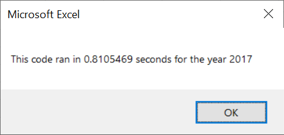

# stock-analysis

## Overview of Project
I was asked by Steve, a friend of mine, to help with investment decision of his parents. They are passionate about green energy, and want to invest everything they have into one and only company called DAQU New Energy Corp. Steve wants to diversify their portfolio. He provided me with an Excel file containing the stock data he wants to analyze. I used VBA to give Steve a tool which is accurate, quick, and easy to scale.

## Results
### Stock Performance Results

As one can see from the table below, the only stocks keeping positive return in 2018 are ENPH and RUN. Both of them increased in daily volume, but only RUN also increased in return. It seems Steve should invest a bigger part of his parents money in RUN and a smaller one in ENPH for diversification purposes. By the way, after looking into the table one could consider further diversification beyond green technologies - which are definitely a great part of any portfolio. But it's up to Steve and his parents.

Ticker | Daily Vol Up/Down | Return Up/Down | Return in 2018 +/-
--- | --- | --- | ---
AY | DOWN | DOWN | -
CSIQ | DOWN | DOWN | -
DQ | UP |  DOWN | -
ENPH | UP | DOWN | +
FSLR | DOWN | DOWN | -
HASI | UP | DOWN | -
JKS | DOWN | DOWN | -
RUN | UP | UP | +
SEDG | UP | DOWN | -
SPWR | DOWN | DOWN | -
TERP | UP | DOWN | -
VSLR | UP | DOWN | -

Here is more detailed statistics in case anyone needs fine-tune their portfolio.

 | 

### Refactoring Results

As can be seen from the table below, refactoring has helped tremendously: my code became about ten times faster.

Before refactoring | After refactoring
--- | ---
 | 
 | 

Here are the screenshots giving an idea why code performance increased tenfold.

Before refactoring | After refactoring
--- | ---
 | 

Code goes through the rows one time, not twelve times, as before. It's 12/1, and after adjustment for some overhead we receive about 10/1.

## Summary

### Advantages and disadvantages of refactoring code in general

- The main advantage of refactoring code is the fact it gets faster and takes less memory.
- The main disadvantage of refactoring is time it takes. The code may also become less readable, but that depends on code authors and there future colleagues. People feel most comfortable reading code written by there peers - not much higher, not much lower then they are.

In general, it's all about "coding faster vs fast code".

### Advantages and disadvantages of the original and refactored VBA script

The VBA code in this particular challenge became much faster and a bit less clear. Refactoring didn't take much time. As dataset is certainly going to be scaled up, it was a good idea to make the code faster.

Some people care about 1 sec vs 0.1 sec, and nearly everyone cares about 10 min vs 1 min.
